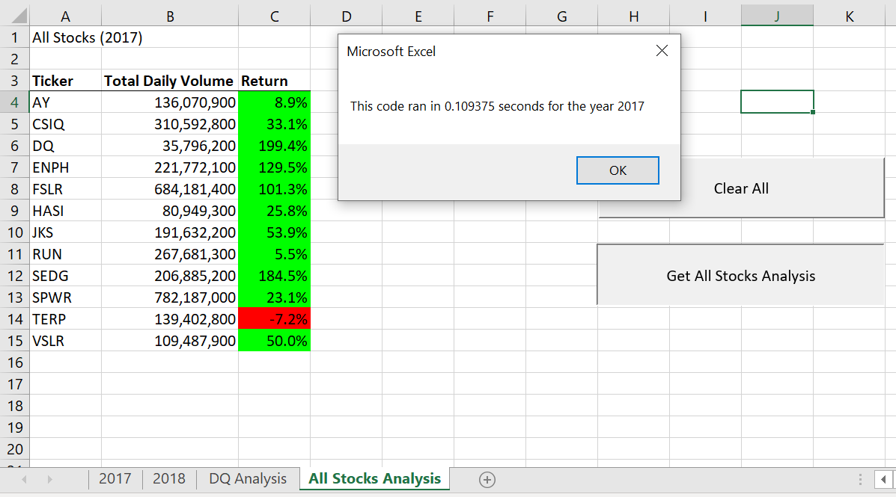
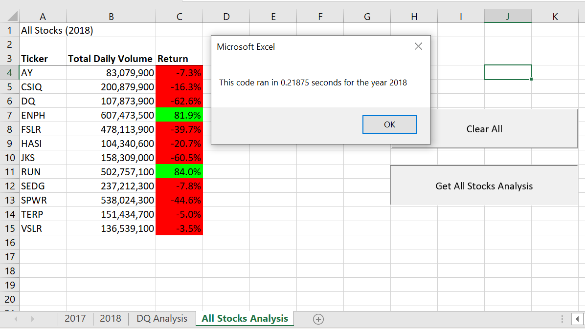
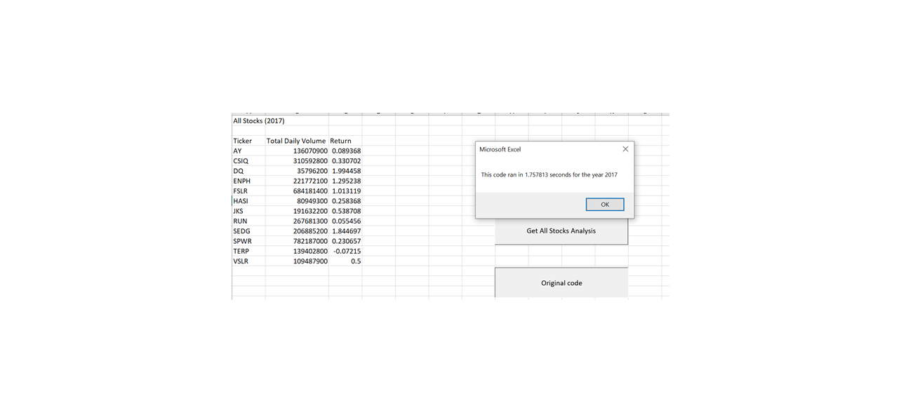
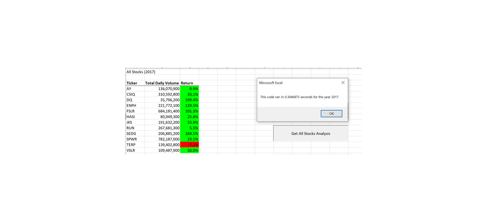
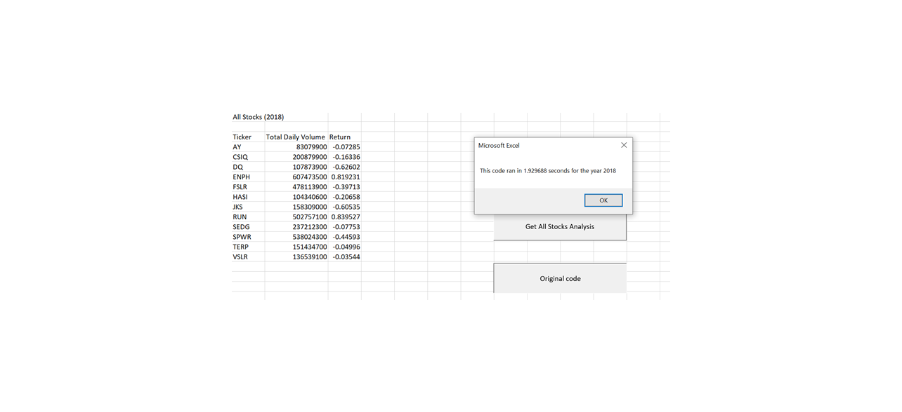
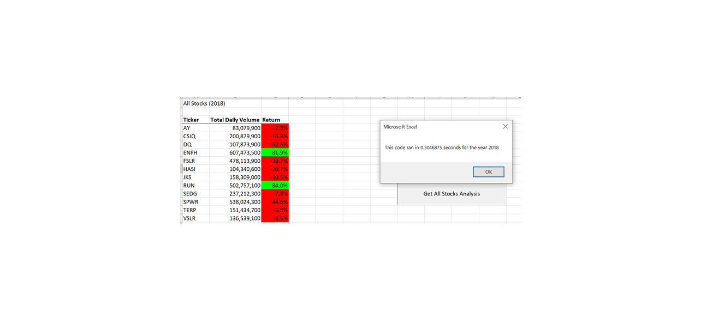

# VBA of Wall Street

## Overview of Project

The purpose of this assignment is to optimize the VBA script used in the module to generate information regarding the stock, in order to collect the same information for all the stock market.

This will provide Steve with valuable information that will allow him to analyse the entire dataset and give a good piece of advice to his parents as of where to invest.

## Results 

 

All Tickers saw a deterioration in their return in 2018 except for RUN that saw an impressive improvement on both total daily volume and return.

Despite ENPH saw a deterioration in return from 129% in 2017 to 81% in 2018, the total daily volume in 2018 increased by almost 3 times.

The strongest return in 2018 were on ENPH and RUN. All other tickers had a negative return in 2018.

## Summary

### Advantages and disadvantages of refactoring code in general

The advantages of refactoring code :

	Refactoring Improves the Design of Software.
	Refactoring Makes Software Easier to Understand.
	Refactoring Helps Finding Bugs.
	Refactoring Helps Programming Faster.

The disadvantages of refactoring code :

	It may introduce bugs.
	It's risky if it doesn't have a proper test cases.
	It may take more time for the delivery.

### Advantages of the original and refactored VBA script

The main noticed advantage of refactoring the original VBA script was a faster execution.

For example:

For 2017 data, totalizing 3,012 data records (lines), execution time using original code was around 1.75 seconds. 

Using the refactored code the execution time went down to around 0.30 second.

Execution time improved by 83% compared to the initial code. In our current case, this improvement may not seem very relevant (moving from a 2 second execution time to less than a second), but as we will be dealing with larger databases, execution timing will be more critical and would be a key factor to have a friendly customer experience when using a report.

Same improvement using 2018 data records:

Execution time was around 1.929 seconds with original code.

Versus 0.30 seconds using the refactored code. 

 

The main disadvantages that is worth mentioning is that is was time consuming to find the right combination of code/functions that would work best and deliver the expect result.

There is also a risk to introduce bugs as the code becomes more complex.
